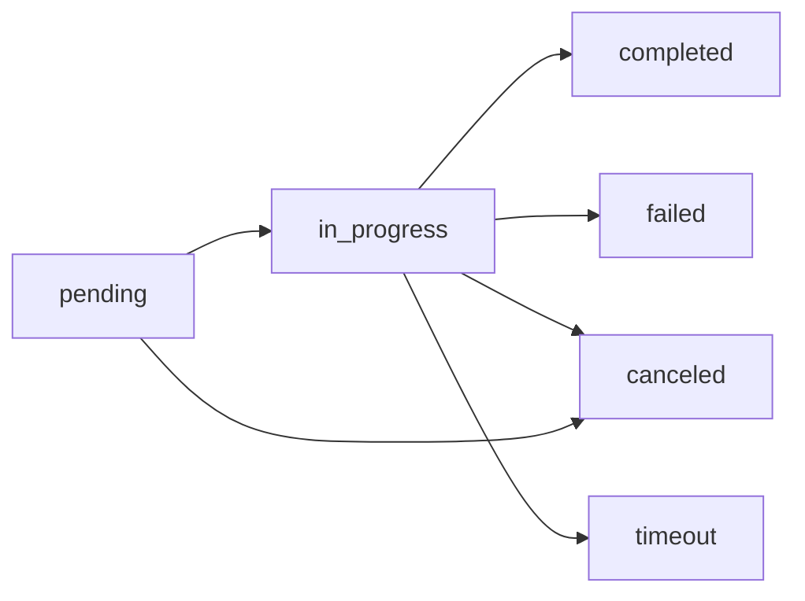

# 状态枚举字典_V2.3

> 版本：v1.0  
> 创建日期：2025-01-28  
> 负责人：星河（Owner），熙龙（Reviewer）  
> 状态：生效中  

## 1. 文档目标

建立统一的状态枚举定义与治理规范，避免语义不一致问题，为 PR 检查与 CI 静态扫描提供标准依据。

## 2. 状态枚举分类与标准定义

### 2.1 Agent 任务/分配状态 (Task/Assignment Status)

**适用场景**：`agent_assignments[].status`、`AgentsTaskResponse.status`、任务执行状态  
**标准枚举**：`[pending, in_progress, completed, failed, canceled, timeout]`

| 状态值 | 中文语义 | 定义 | 可转换至 | 不可转换至 |
|--------|----------|------|----------|------------|
| `pending` | 待处理 | 任务已分配但未开始执行 | `in_progress`, `canceled` | `timeout` |
| `in_progress` | 执行中 | 任务正在执行中 | `completed`, `failed`, `canceled`, `timeout` | - |
| `completed` | 已完成 | 任务成功完成 | - | 任何状态（终态） |
| `failed` | 执行失败 | 任务执行出现错误 | - | 任何状态（终态） |
| `canceled` | 已取消 | 任务被用户或系统主动取消 | - | 任何状态（终态） |
| `timeout` | 超时 | 任务因超时自动终止 | - | 任何状态（终态） |

**禁用值**：`active`（会与授权状态混淆）、`running`（语义重复）、`success`（用 completed）、`error`（用 failed）

### 2.2 Agent 运行状态 (Agent Runtime Status)

**适用场景**：`GET /agents/status` 响应中的 `agents[].status`  
**标准枚举**：`[idle, busy, error, maintenance]`

| 状态值 | 中文语义 | 定义 | 监控含义 |
|--------|----------|------|----------|
| `idle` | 空闲 | Agent 未执行任何任务，可接受新任务 | 可用容量 |
| `busy` | 忙碌 | Agent 正在执行任务，暂不可接受新任务 | 使用中容量 |
| `error` | 异常 | Agent 出现故障，需人工干预 | 故障容量 |
| `maintenance` | 维护中 | Agent 正在维护，计划内不可用 | 维护容量 |

### 2.3 授权/许可状态 (Consent/Permission Status)

**适用场景**：`Consent.status`、用户授权管理  
**标准枚举**：`[active, revoked, pending]`

| 状态值 | 中文语义 | 定义 | 业务含义 |
|--------|----------|------|----------|
| `active` | 已激活 | 授权生效，可正常使用相关功能 | 有效授权 |
| `revoked` | 已撤销 | 授权被用户或系统撤销 | 无效授权 |
| `pending` | 待处理 | 授权申请提交但未生效 | 审核中 |

**注意**：此场景下 `active` 为合法用法，表示"已激活/生效"。

### 2.4 云同步任务状态 (CloudSync Job Status)

**适用场景**：`CloudSyncJob.status`  
**标准枚举**：`[pending, in_progress, completed, failed, timeout, manual_required]`

| 状态值 | 中文语义 | 定义 |
|--------|----------|------|
| `pending` | 待同步 | 同步任务已创建但未开始 |
| `in_progress` | 同步中 | 正在执行同步操作 |
| `completed` | 同步完成 | 同步成功完成 |
| `failed` | 同步失败 | 同步过程中出现错误 |
| `timeout` | 同步超时 | 同步操作超时 |
| `manual_required` | 需手工处理 | 冲突或异常，需人工干预 |

## 3. 监控指标标准化

### 3.1 Agent 相关指标

```yaml
# 推荐指标名称
agents.total.count              # 总 Agent 数量
agents.idle.count               # 空闲 Agent 数量
agents.busy.count               # 忙碌 Agent 数量  
agents.error.count              # 异常 Agent 数量
agents.maintenance.count        # 维护中 Agent 数量

# 任务相关指标
tasks.pending.count             # 待处理任务数
tasks.in_progress.count         # 执行中任务数
tasks.completed.count           # 已完成任务数
tasks.failed.count              # 失败任务数
tasks.canceled.count            # 已取消任务数
tasks.timeout.count             # 超时任务数
```

### 3.2 禁用指标名称

```yaml
# ❌ 禁用（语义模糊）
agents.busy.count               # 运行中Agent数量，已从 agents.active.count 修正
tasks.success.count             # 改为 tasks.completed.count  
tasks.running.count             # 改为 tasks.in_progress.count
```

## 4. PR 检查清单

### 4.1 必检项

- [ ] 新增状态枚举是否在本字典中定义？
- [ ] 是否误用 `active` 表示执行中状态？
- [ ] 状态转换是否符合状态机规则？
- [ ] 监控指标命名是否规范？
- [ ] Postman 断言是否覆盖新状态？

### 4.2 静态扫描规则

#### 规则1：禁止在 Agent 执行语境使用 active
```regex
# 匹配模式（需告警）
agent_assignments.*status.*active
AgentsTaskResponse.*status.*active  
tasks?\..*\.status.*active
```

#### 规则2：任务状态枚举校验
```regex
# 合法模式
status.*pending|in_progress|completed|failed|canceled|timeout

# 非法模式（需告警）
status.*(running|success|error|active)
```

#### 规则3：Agent 运行状态枚举校验
```regex
# 合法模式（GET /agents/status 场景）
agents\[\]\.status.*(idle|busy|error|maintenance)

# 非法模式
agents\[\]\.status.*(active|running|available)
```

## 5. 异常场景与处理

### 5.1 历史数据兼容
- 对于生产环境中已存在的 `active` 状态数据，通过数据迁移脚本转换为 `in_progress`
- 迁移脚本需记录转换映射，支持回滚

### 5.2 第三方集成兼容
- 网关层提供向后兼容映射：`active` → `in_progress`（仅限过渡期）
- 兼容期限：2 周，到期后移除
- 兼容开关：默认关闭，按租户白名单启用

### 5.3 新状态扩展流程
1. 提交状态枚举变更提案（包含业务场景、状态转换图、影响分析）
2. 更新本字典文档
3. 同步修改 OpenAPI、文档、测试用例
4. 通过 PR 检查清单验证

## 6. 治理工具

### 6.1 CI 集成
- 每日执行状态枚举一致性扫描
- PR 提交时自动检查状态枚举规范
- 失败时阻断合并，生成检查报告

### 6.2 监控告警
```yaml
# 推荐告警规则
docs_contract.check.fail.count > 0     # 文档契约检查失败
postman.contract.fail.count > 0        # Postman 契约检查失败
enum.validation.error.count > 0        # 枚举校验错误
```

## 7. 维护与更新

- **更新频率**：按需更新，重大变更需版本化
- **责任人**：星河（Owner），熙龙（Reviewer）
- **复盘周期**：每两周回顾一次契约一致性与断言覆盖率
- **变更审批**：状态枚举变更需经过设计评审，影响 ≥1 子系统需升级审批

---

**版本历史**

| 版本 | 日期 | 变更内容 | 负责人 |
|------|------|----------|--------|
| v1.0 | 2025-01-28 | 初始版本，基于 active 语义审计结果创建 | 星河 |

**附录：状态转换图**

